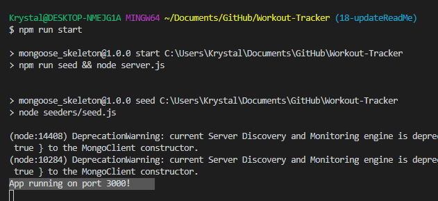

# Homework 17 - Workout Tracker


## Description

The goal for this assignment is to create a full stack workout tracker web application that will allow a user to keep track of their workout regime by using MongoDB and Mongoose schema for database creation/management and Express for handling routes.

The main focus for this assignment is to practice using MongoDB and Mongoose for database management, the front-end code was provided in the homework assignment's directory for us to leverage for this assignment. _**However**, in order for the dashboard to accurately (and dynamically) populate workout data, I had to make significant modification to the front-end code that was provided._

---

## Table of Contents

Please use the links in the table of contents provided below to navigate through this project's ReadMe.

- [Links for Submission Items](#links-for-submission-items)
- [Assignment Scope](#assignment-scope)
  - [User Story](#user-story)
  - [Acceptance Criteria](#acceptance-criteria)
- [Installation](#installation)
  - [Required Technology](#required-technology)
  - [Installation Instructions](#installation-instructions)
  - [Start Application](#start-application)
- [Final Output](#final-output)

---

## Links for Submission Items

Here are the links to the MVP items required for this assignment. Ihese links will also be submitted in the Boot Camp Spot portal.

- Link to GitHub Repo - [Workout Tracker Repo on GitHub](https://github.com/KEDuran/Workout-Tracker)

- Link to deployed application - [Workout Tracker App deployed on Heroku](https://workout-tracker-ked.herokuapp.com/)

- Link for functionality demo - [Workout Tracker App demo recording](https://drive.google.com/file/d/1Mex2MzIYoetWCVNu5YDkb5Fm-yj8BNTB/view?usp=sharing)

---

## Assignment Scope

### User Story

Here is the user story that was provided in the intructional ReadMe file for this assignment.

```
As a user, I want to be able to view create and track daily workouts.
I want to be able to log multiple exercises in a workout on a given day.
I should also be able to track the name, type, weight, sets, reps, and duration of exercise.
If the exercise is a cardio exercise, I should be able to track my distance traveled.
```

### Acceptance Criteria

Here are the acceptance criteria that was provided in the intructional ReadMe file for this assignment.

```
When the user loads the page, they should be given the
option to create a new workout, or continue with their last workout.

The user should be able to:

  * Add exercises to a previous workout plan.

  * Add new exercises to a new workout plan.

  * View multiple the combined weight of multiple exercises on the `stats` page.
```

---

## Installation

### Required Technology

In order to success launch this web application, you will need to have the following installed in your local working environment:

- **Node.js** - Make sure Node.js is installed in your machine. If Node.js is not installed on your machine, [click here](https://nodejs.org/en/) to download the application.
- **MongoDB** - Install MongoDB to enable your local environment to access the database structure used to store the back-end data for this application. [Click here](https://www.mongodb.com/try/download/community) to download MongoDB.
- **Robo 3T** - Robo 3T is an application that gives users to use an easy graphic user interface (GUI) to view and query data in a MongoDB database. [Click here](https://robomongo.org/download) to download Robo 3T.
  - _FYI - Do not install STUDIO 3T. It is not needed for this repo._
- **Postman** - Postman allow users to query the API endpoints developed for this web application. [Click here](https://www.postman.com/) for additional instructions on how to download and use this application.

### Installation Instructions

All NPM packages needed for this application are already listed as dependencies in the `package.json` file. If running this web application in your local environment, please make sure to run the `npm install` command in your terminal at the root directory level in order to access all required package.

Here is a list of the dependencies used for the development of this application:

- **Express** - Reference the provided link for more information regarding this package: [NPM Express Package](https://www.npmjs.com/package/express)
- **Mongoose** - Reference the provided link for more information regarding this package: [NPM Mongoose Package](https://www.npmjs.com/package/mongoose)
- **Morgan** - Reference the provided link for more information regarding this package: [NPM Morgan Package](https://www.npmjs.com/package/morgan)

### Start Application

After all required dependencies have been installed, run the command `npm run start` in you the terminal under the root directory in order to launch the application. The screenshot provided below is what should outplu of the application is launched successfully in your local environment.



---

## Final Output

To demonstrate the functionality of the Workout Tracker App, here is a link to a demo recording I created to show the full functionality of the deployed app. Please note that the demo recording link provided below is also listed in the [Links for Submission Items](#links-for-submission-items) section located at the beginning of this ReadMe document.

- Link for functionality demo - [Workout Tracker App demo recording](https://drive.google.com/file/d/1Mex2MzIYoetWCVNu5YDkb5Fm-yj8BNTB/view?usp=sharing)
